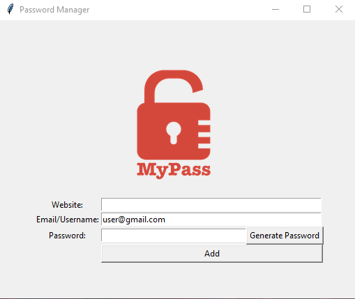

# 🔐 Password Generator (Tkinter App)

> 🗓️ Project built on **Day 29 and 30** of the **Angela Yu – 100 Days of Code** course.  
> A desktop GUI app that generates strong, secure passwords, inserts them automatically into an entry field, copies them to the clipboard, and lets you save and search passwords by website.

## ✨ Features

- Generates secure passwords using **letters**, **numbers**, and **symbols**
- Password length is randomized:
  - 8–10 letters
  - 2–4 symbols
  - 2–4 numbers
- Password is:
  - Shuffled for extra randomness
  - Inserted automatically in the password entry field
  - Copied automatically to the clipboard for easy pasting
- **Save passwords** linked to websites and emails
- **Search saved passwords by website name**
- Stores data in a **JSON file** for structured, easy data management
- Built with a clean and intuitive **Tkinter GUI**

  ## 📷 Screenshot

## 🧠 What I Learned

- Building GUI applications using `Tkinter`
- Using `random` module functions (`choice`, `randint`, `shuffle`) for password creation
- Refactoring code with **list comprehensions** and `"".join()` for Pythonic clarity
- Managing persistent data in JSON format
- Searching and retrieving saved data effectively
- Copying passwords automatically to clipboard for user convenience

## 🛠 Tech Stack

- Python 3
- Tkinter for GUI
- `random` module for password generation
- `json` module for data storage and retrieval
- `pyperclip` or Tkinter clipboard methods for clipboard management

