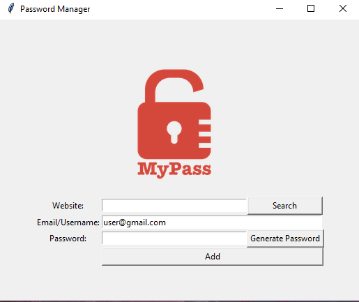

# 🔐 Password Generator (Tkinter App)

A simple and secure **password generator** built with Python and Tkinter, as part of a 100 Days of Code challenge.  
The app creates strong, random passwords and copies them automatically to your clipboard for quick use.

## ✨ Features

- Generates secure passwords using **letters**, **numbers**, and **symbols**
- Uses **random lengths**: 8–10 letters, 2–4 symbols, and 2–4 numbers
- Password is:
  - Shuffled for extra randomness
  - Automatically **inserted in the entry field**
  - Automatically **copied to the clipboard**
- Built-in with a clean and minimal **Tkinter GUI**

  ## 📷 Screenshot

> *(Add a screenshot named `screenshot.png` in your repo and uncomment the line below)*

<!--  -->

## 🧠 What I Learned

- How to build GUI apps using `Tkinter`
- How to generate random passwords using `random.choice()`, `randint()`, and `shuffle()`
- Refactoring loops into **list comprehensions** for clean, Pythonic code
- Using `"".join()` to convert a list of characters into a password string
- Copying to the clipboard using `pyperclip` or `clipboard_append()`

## 🛠 Tech Stack

- Python 3
- Tkinter for GUI
- `random` module for password generation
- *(Optionally)* `pyperclip` for clipboard support (cross-platform)

